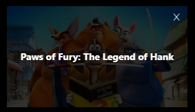

# Clone da Página da Netflix com React e Tailwind CSS

## Tailwind CSS
    - yarn add -D tailwindcss postcss autoprefixer
    - npx tailwindcss init -p - para criar o arquivo de configuração do tailwind

## Dependências
- yarn add axios react-router-dom firebase
- yarn add react-icons tailwind-scrollbar-hide

## Plugins
- Tailwind CSS IntelliSense
- Prettier
- ES7+ React/Redux/React-Native snippets

## API
- Movie Database - https://www.themoviedb.org/
- Usei Axios pafa fazer a chamada da API - yarn add axios react-router-dom firebase
- Utilizei Context para a API verificar se o usuário está ou não logado (https://firebase.google.com/?gclid=CjwKCAjwkaSaBhA4EiwALBgQaGIvyPK_ff74ux9PfKcnqYW90mfineyTJ-bm0AShRYN6Yq7AfCAjtBoClGMQAvD_BwE&gclsrc=aw.ds)

## Atalhos
- rafce - cria um componente funcional

## Walkthrough
- Nesse projeto, o usuario logado pode salvar seus filmes favoritos

- Estes serão mostrados na página Account 

- Na página Account o usuário terá a opção de remover filmes favotirados

- A opção de salvar filmes, só pode ser utilizada se o usuário estiver logado!